# Clase 2 - Dockerfiles y construccion de imagenes

## 1. Descripción de la aplicación
**Lenguaje:** Node.js  
**Framework:** Express  
**Descripción:** API REST simple con 3 endpoints.

**Endpoints**
- `GET /` — Mensaje de bienvenida y uptime.
- `GET /health` — Estado de salud (JSON con hostname, pid).
- `POST /echo` — Devuelve el body enviado.

## 2. Dockerfile (multi-stage)
Archivo adjunto [Ver Dockerfile](Dockerfile)
### Etapa 1 - Construcción (build)
Instala dependencias de producción (npm ci --only=production) y prepara artefactos
```
FROM node:18-alpine AS build

LABEL maintainer="Ariana Choque <choqueariana2912@gmail.com>"
LABEL org.opencontainers.image.source="https://github.com/HonorioNoemi/mi-app"

ENV NODE_ENV=production
ENV APP_DIR=/usr/src/app

WORKDIR $APP_DIR

COPY app/package*.json ./

RUN npm ci --only=production

COPY app/src ./src

RUN addgroup -S appgroup && adduser -S appuser -G appgroup
```
### Etapa 2 - Producción (runtime)
Copia sólo node_modules y src desde build, ejecuta app con usuario non-root.
```
FROM node:18-alpine AS runtime

LABEL org.opencontainers.image.licenses="MIT"

ENV NODE_ENV=production

ENV APP_DIR=/usr/src/app
ENV PORT=3000

WORKDIR $APP_DIR

RUN addgroup -S appgroup && adduser -S appuser -G appgroup

COPY --from=build /usr/src/app/node_modules ./node_modules
COPY --from=build /usr/src/app/src ./src
COPY app/package*.json ./

RUN chown -R appuser:appgroup $APP_DIR

EXPOSE ${PORT}

HEALTHCHECK --interval=30s --timeout=5s --start-period=5s --retries=3 \
  CMD wget -qO- http://localhost:${PORT}/health >/dev/null 2>&1 || exit 1

USER appuser

LABEL org.opencontainers.image.version="1.0.0"
LABEL org.opencontainers.image.title="mi-app"

CMD ["node", "src/index.js"]
```
### Instrucciones principales

- `EXPOSE 3000` — puerto documentado.
- `USER appuser` — usuario non-root.
- `HEALTHCHECK` — comprueba /health.

## 3. Proceso de build
```
export DOCKER_BUILDKIT=1
docker build -t mi-app:1.0 .
```
Mensaje de salida:

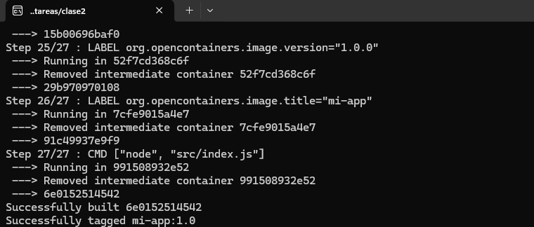

Tamaño final: 132 MB

| Commandp | Descripción |
| --- | --- |
| `docker build -t mi-app:1.0 . `| Construir la imagen |

**Captura :**

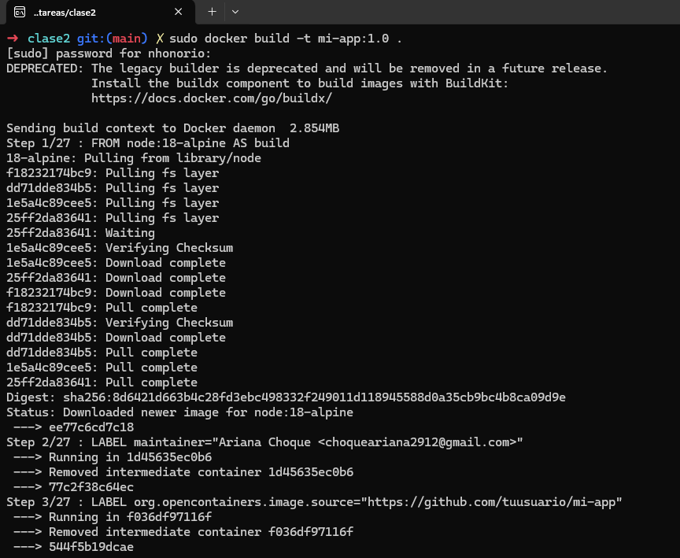

| Commandp | Descripción |
| --- | --- |
| `docker images` | Verificar imágenes locales |

**Captura :**

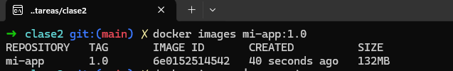

| Commandp | Descripción |
| --- | --- |
| `docker run -d -p 3000:3000 --name mi-app mi-app:1.0`| Ejecutar el contenedor |

**Captura :**

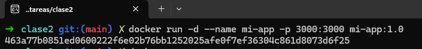

| Commandp | Descripción |
| --- | --- |
| `docker ps` | Verificar ejecución |

**Captura :**

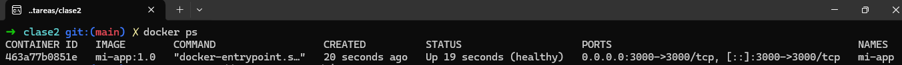

##4. Validaciones
**Endpoints 1**
```
curl http://localhost:3000/
```
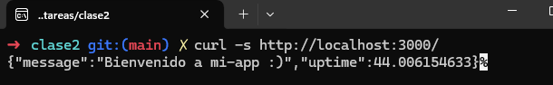

**Endpoints 2**
```
curl http://localhost:3000/health
```

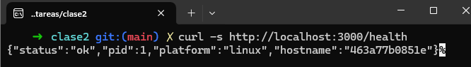

**Endpoints 3**
```
curl -X POST http://localhost:3000/echo -H 'Content-Type: application/json' -d '{"hola":"mundo"}'
```
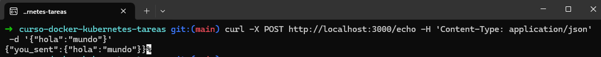

## 5. Publicación en Docker Hub
Comandos empleados:
```
docker login
```

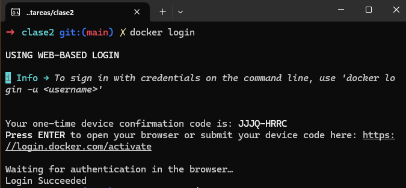

```
docker tag mi-app:1.0 arinoemi/mi-app:1.0
docker push arinoemi/mi-app:1.0
```

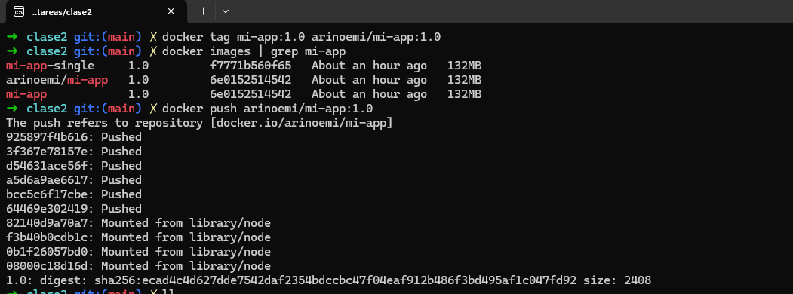

URL: [https://hub.docker.com/r/tuusuario/mi-app](https://hub.docker.com/r/arinoemi/mi-app)

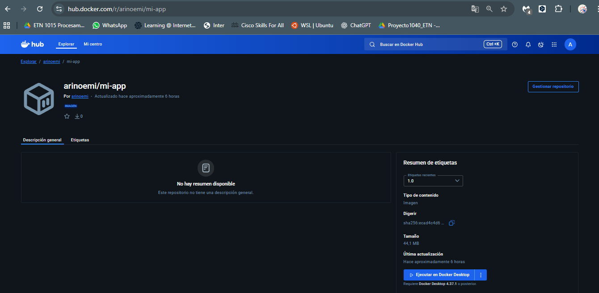

## 6. Optimizaciones aplicadas
| Mejora | Descripción |
| --- | --- |
| Multi-Stage Build | Reduce el tamaño final de la imagen al separar la instalación y el runtime. |
| Imagen base alpine | Imagen ligera, optimiza tamaño y seguridad |
| .dockerignore | Evita subir archivos innecesarios |
| Usuario non-root | Mejora seguridad |
| EXPOSE documentado | Puerto 3000 |

###Comparación:
multi-stage: 132MB
single-stage: 132MB
Se probo la mejora aplicando archivo Dockerfile.simplified

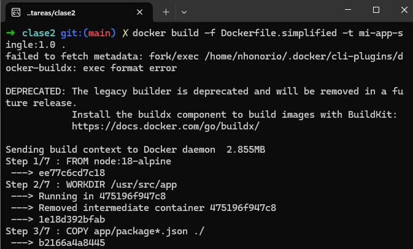

Sin observar cambios con respecto al tamaño (captura de comparación):

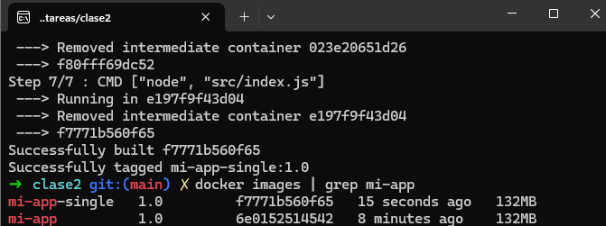

## 7. Conclusiones
Durante el desarrollo de esta práctica se aprendió a:
 - Crear una aplicación Node.js básica y contenerizarla.
 - Aplicar multi-stage builds para optimizar tamaño.
 - Usar .dockerignore y buenas prácticas en Dockerfiles.
 - Publicar imágenes en Docker Hub.


